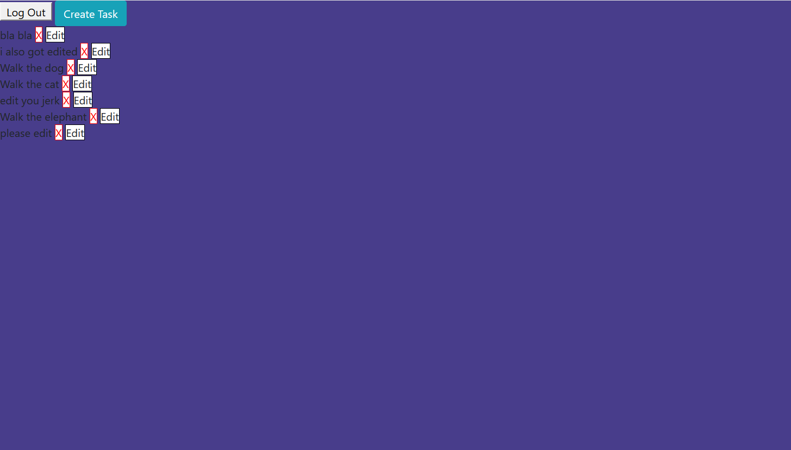

## Firebase To-Do App
This program is a super simple to-do list program that lets you view a list of tasks to do and add/edit/delete them from the list.  It uses firebase as a database for the to do lists.  

### Screenshots

### How to run this app
To run this app you will need a firebase account and a new project.

1.  Configure Firebase
* create a public realtime database in your new firebase project
* In the db folder rename `apiKeys.json.example` to `apiKeys.json`
* Add in the config object from your firebase project to `apiKeys.json`
2.  Serve up the app
* At the root of the project: `npm install`
* `npm start` to run a hot updated build
* `npm build` to create a distribution
* Inside the program use must click the log-in button to sign-in with google to use the program.